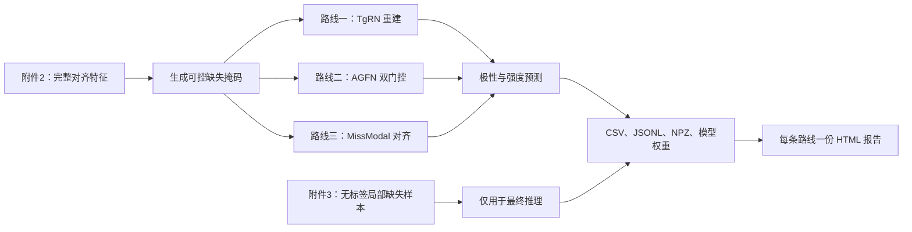

# 数学建模

## 问题二：模态缺失下的鲁棒多模态情感预测

问题二研究文本、语音或视觉特征在局部时段不可用时的情感预测。模型需要同时输出情感极性和连续情感强度，并定量分析缺失模态、缺失位置及缺失时长对性能的影响。

训练和验证使用 `E/E题数据/E题数据/附件2-数据集特征文件/aligned_50.pkl` 中的对齐特征。附件3是无标签最终推理集，不得参与训练、阈值选择或超参数选择。

完整实施约定见 `plans/2026-09-23-question2-three-route-experiments.md`。问题二源代码位于 `scripts/question2/`，实验生成物位于 `artifacts/question_2/`。

### 共享流程

三条路线使用相同的训练/验证划分、冻结的本地 DistilBERT 文本编码器、语音/视觉投影层、极性分类头、强度回归头、评价指标及产物格式。训练和推理均使用 `text_bert`，而不使用仅训练集具备的预计算 `text` 字段，因为附件3只提供 `text_bert`。



### 路线一：TgRN 启发的潜表示重建

该路线从可见模态重建缺失模态的时间步表示，并以文本作为主要引导信息。模型在128维模态潜表示上进行跨模态注意力，仅在人工遮挡的有效位置填入重建值，再进行联合情感预测。

重建目标始终是完整潜表示，重建损失仅计算原本有效且被人工遮挡的位置：

$$
\mathcal L = \mathcal L_{\mathrm{cls}} + \lambda_r\mathcal L_{\mathrm{reg}}
+ \lambda_{\mathrm{rec}}\sum_{m,t\in\Omega_m}
\operatorname{SmoothL1}(\hat h_m(t), h_m(t)).
$$

其中，$\Omega_m$ 是模态 $m$ 的人工缺失位置集合。本实现是 TgRN 的潜表示重建改造，不声称严格复现其原始特征重建。报告将保存逐样本、逐模态的重建误差。

### 路线二：AGFN 启发的双门控融合

该路线不重建缺失信号，而是估计各模态的可靠性，动态降低不完整模态的影响。

模型包含两类门控：

1. 熵可靠性门：模态表示熵越低，其可靠性越高。
2. 学习式模态重要性门：输入池化后的模态特征、可观测比例与缺失比例。

两种门控得到的融合表示由可学习系数混合。不可用模态在 softmax 前被掩码，其最终权重为零。虚拟对抗训练（VAT）约束融合表示发生微小扰动后的预测稳定性：

$$
\mathcal L = \mathcal L_{\mathrm{task}}
+ \lambda_{\mathrm{vat}}\lVert p(z)-p(z+r_{\mathrm{adv}})\rVert_2^2,
\qquad \lambda_{\mathrm{vat}}=0.1.
$$

AGFN 原文未定义局部缺失掩码协议，因此本路线应表述为面向赛题的 AGFN 启发扩展。产物包括熵权重、学习式重要性门、混合系数、最终模态权重及 VAT 损失。

### 路线三：MissModal 启发的表征对齐

该路线学习同一样本完整版本与缺失版本应产生相容的情感表示。模型以共享编码器构造完整与缺失视图：文献对照时支持所有非空模态子集，赛题实验时保留连续局部缺失掩码。

训练目标由四部分组成：

$$
\mathcal L = \mathcal L_{\mathrm{task}}^{\mathrm{full}}
+ \mathcal L_{\mathrm{task}}^{\mathrm{masked}}
+ \lambda_{\mathrm{dis}}\lVert z_{\mathrm{full}}-z_{\mathrm{masked}}\rVert_2^2
+ \lambda_{\mathrm{geo}}\mathcal L_{\mathrm{InfoNCE}}.
$$

配对距离项对齐同一语句的完整与缺失表征；批内对比几何项使匹配的完整语句比同批其他语句更接近。报告将保存各损失项和每个不完整模态子集的结果。

### 评估协议

两套协议回答不同问题，必须分别持久化和报告，不能合并统计。

| 协议 | 缺失形式 | 目的 |
|---|---|---|
| 赛题协议 | 有效时间步内的连续局部缺失；扫描缺失模态、前/中/后位置及10%-70%时长 | 直接回答问题二 |
| 文献对照协议 | 10%-90%的随机独立特征位置缺失，以及 `T`、`A`、`V`、`TA`、`TV`、`AV` 不完整模态子集 | 对照 TgRN 和 MissModal 的假设 |

每个条件报告 Accuracy、macro-F1、weighted-F1、MAE 和 Pearson 相关系数。固定种子 `42` 至 `46` 独立运行，路线汇总报告均值和标准差。

### 可复现实验产物与报告

每条路线、每个随机种子都保存解析后的配置、环境元数据、数据清单、逐轮训练历史、验证预测、精确验证掩码、扰动指标、模型权重及附件3预测。重建路线额外保存重建指标。路线级 `summary.csv` 和 `report.html` 汇总五个种子。

```text
artifacts/question_2/<route>/
  summary.csv
  report.html
  seed_<seed>/
    train_history.jsonl
    validation_predictions.csv
    perturbation_metrics.csv
    whole_modality_metrics.csv
    masks_validation.npz
    test_predictions.csv
    checkpoint_best.pt
    checkpoint_last.pt
```

HTML 报告仅包含表格和产物链接，不提前绘图；后续作图所需的全部派生测量均保留为 CSV、JSONL 或 NPZ。

### 可选的课程学习

图文课程学习参考文献不是第四条模态缺失路线。后续可将其作为单独标注的训练期共享增强，且必须对所有路线一视同仁；不得混入三路线主对比。

### 计划执行命令

`scripts/question2/` 实现完成后，三条路线应串行执行，因为它们共享同一块 GPU：

```bash
UV_CACHE_DIR="$PWD/.uv-cache" uv run python scripts/question2/run_experiment.py --route reconstruction
UV_CACHE_DIR="$PWD/.uv-cache" uv run python scripts/question2/run_experiment.py --route gated_fusion
UV_CACHE_DIR="$PWD/.uv-cache" uv run python scripts/question2/run_experiment.py --route missmodal_alignment
```
