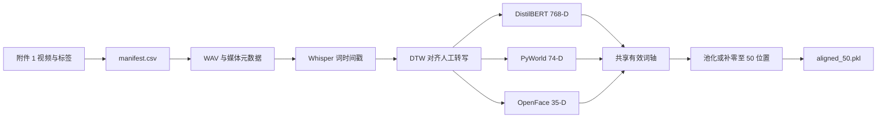
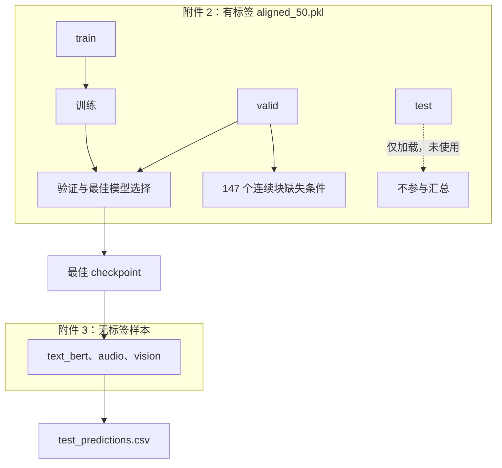

# 模型、实验与结果文件说明

本项目包含两个独立问题：Question 1 从原始视频和标注构建定长多模态特征；Question 2 在已对齐特征上训练并评估模态局部缺失下的情感预测模型。两者的输入、产物和入口不同，Question 1 的特征构建结果不作为 Question 2 的训练集。

## 运行环境

项目使用 Python 3.13+ 和 `uv`。在仓库根目录运行：

```bash
UV_CACHE_DIR="$PWD/.uv-cache" uv sync
```

模型从 `.hf-cache/` 本地加载，不下载资产。Question 1 还需要 `ffmpeg`、`ffprobe` 和 `/opt/openface/bin/FeatureExtraction`：

```bash
UV_CACHE_DIR="$PWD/.uv-cache" uv run python scripts/question_1/check_tools.py
```

## Question 1：原始多模态特征构建

Question 1 将附件 1 的视频、人工转写和情感标注转为按词对齐的定长特征。配置在 `configs/question_1.yaml`。这是特征构建流水线，不训练下游情感预测模型。

- 文本：本地 `distilbert-base-uncased`，每个有效人工词为 768 维向量。
- 音频：视频转为 16 kHz 单声道 WAV；PyWorld 提取基频、浊音、能量、60 维谱特征和 11 维非周期性特征，共 74 维。
- 视觉：OpenFace 提取 AU、头姿、视线和关键点几何特征，共 35 维。
- 标签：回归标签范围为 `[-3, 3]`，分类标注保留自源数据。



### 流程

1. `build_manifest.py` 验证标签列、标签范围、视频路径和样本 ID，写入 `manifest.csv`。
2. `extract_media.py` 提取 WAV 并记录媒体元数据。
3. `align_words.py` 使用本地 Whisper 获取词时间戳，以 DTW 对齐人工转写。每个未匹配词都保存 `unmatched_reason`；接受词保留 ASR 索引和 DTW 代价。
4. `extract_text.py` 对有效人工词进行 WordPiece 均值池化，保存词向量、原词索引和 token 范围。
5. `extract_audio.py`、`extract_vision.py` 按词时间区间重叠加权池化。无有效区间或无可用人脸帧的位置填零并记录原因。
6. `build_aligned_50.py` 以文本有效 `word_indices` 为共享轴，过滤音频/视觉行；长序列池化为 50 个非空区间，短序列或空序列末尾补零。

批处理入口是 `scripts/question_1/run_pipeline.py`。它按样本 ID 顺序运行，默认输出至 `artifacts/question_1/pipeline_v2/`；仅在源文件哈希和提取器配置哈希均一致时跳过已完成样本。

```bash
UV_CACHE_DIR="$PWD/.uv-cache" uv run python scripts/question_1/run_pipeline.py --config configs/question_1.yaml
UV_CACHE_DIR="$PWD/.uv-cache" uv run python scripts/question_1/validate_output.py --config configs/question_1.yaml
UV_CACHE_DIR="$PWD/.uv-cache" uv run python scripts/question_1/build_summary.py --config configs/question_1.yaml
```

OpenFace 提取耗时较长，应在 `tmux` 中串行运行，避免同时启动两个批处理任务。

### Question 1 结果文件

| 路径 | 说明 |
| --- | --- |
| `artifacts/question_1/manifest.csv` | 已验证的样本 ID、转写、标签、分类标注和视频路径。 |
| `pipeline_v2/media_metadata.jsonl` | 视频/WAV 时长、帧率和来源元数据。 |
| `pipeline_v2/word_alignment.jsonl` | 人工词、Whisper 词、DTW 代价、时间区间、未匹配原因和池化位置映射。 |
| `pipeline_v2/text/<id>.npz` | `features`、`word_indices`、`token_spans`。 |
| `pipeline_v2/audio/<id>.npz` | 74 维词级特征、源帧范围和缺失原因。 |
| `pipeline_v2/vision/<id>.npz` | 35 维词级特征、源帧范围、缺失原因和人脸检测率。 |
| `pipeline_v2/aligned_50.pkl` | 定长输出：文本、音频、视觉形状为 `(N, 50, 768)`、`(N, 50, 74)`、`(N, 50, 35)`。 |
| `pipeline_v2/logs/status.jsonl` | 样本完成、跳过或失败状态、耗时和报错。 |
| `inspection/` | 短/长样本的逐词 CSV、时间轴 SVG 和选择说明。 |
| `feature_summary.csv` | 每个样本的有效长度、特征维度、人脸检测率和警告。 |
| `run_metadata.json` | 输入、工具/包版本、配置哈希和运行命令。 |

`validate_output.py` 检查 ID 覆盖、标签一致性、共享有效长度、固定形状、有限数值和零填充约定。

## Question 2：模态缺失鲁棒情感预测

源码在 `scripts/question2/`，实验入口为 `scripts/question2/run_experiment.py`。



### 数据边界

- **附件 2**：仅使用 `E/E题数据/E题数据/附件2-数据集特征文件/aligned_50.pkl` 训练和验证。入口使用 `train` 和 `valid`；`test` split 会被加载但不构造 DataLoader。
- **附件 3**：仅做无标签最终推理。不得参与训练、阈值/最佳轮次选择、超参数调优或性能比较。
- 每个样本使用 `text_bert`、音频和视觉。文本注意力掩码定义有效时间步；音频/视觉仅在文本有效且该行特征非零时可用。

### 共享骨干和四条路线

四个路线都使用冻结的本地 DistilBERT。文本、音频、视觉分别映射为 128 维时间表示；输出三分类情感极性 logits 和截断至 `[-3, 3]` 的连续情感强度。监督损失为加权交叉熵与 Smooth L1 回归损失之和。

| 路线 | 模型构建与缺失处理 |
| --- | --- |
| `reconstruction` | 以位置嵌入和跨模态单头注意力，从可观测时间表示重建人工遮挡位置的 128 维潜表示。重建损失仅计算原本有效且被遮挡的位置。 |
| `gated_fusion` | 对每个模态做掩码时间池化。熵可靠性门和学习式重要性门仅在可用模态上归一化，缺失模态权重为零；训练期加入 VAT。 |
| `missmodal_alignment` | 共享编码器构造完整和人工缺失视图，联合优化完整/缺失任务损失、配对表征距离和批内对比几何损失。 |
| `self_distillation` | 两个独立连续块缺失视图共享编码器；MMD 表征对齐、分类和回归一致性约束正则化门控任务预测。推理时复制实际缺失视图，不加载外部教师。 |

### 掩码、训练和评估

每条路线以种子 `42`--`46` 独立运行，并在构建模型前固定随机种子。`training.mask_protocol` 决定人工训练掩码：

- `fixed`：所有模态的中间连续 30% 遮挡，见 `config_seeded_baseline.yaml`。
- `competition`：每个 batch 从 7 个模态子集、7 个遮挡率（10%--70%）和 3 个位置（前/中/后）采样，见 `config_robustness.yaml`。
- `none`：无人工训练掩码，保留自然可用性掩码，见 `config_complete_view.yaml`。

每轮在无人工掩码的 `valid` 上计算 Accuracy、macro-F1、weighted-F1、MAE 和 Pearson；按最高 weighted-F1、再按最低 MAE 选择最佳轮次。最佳模型随后在同一验证集评估：

- **赛题协议**：有效时间步上的连续缺失，7 个模态子集 × 7 个比例 × 3 个位置，即每种子 147 个条件。
- **文献对照协议**：随机位置缺失和整模态缺失。该协议不能与赛题协议合并统计。

各路线共享 GPU，应在 `tmux` 中串行运行。首次运行不要使用 `--resume`；恢复运行必须有可读的 `checkpoint_last.pt`。

```bash
UV_CACHE_DIR="$PWD/.uv-cache" uv run python scripts/question2/run_experiment.py --route reconstruction --config scripts/question2/config_seeded_baseline.yaml
UV_CACHE_DIR="$PWD/.uv-cache" uv run python scripts/question2/run_experiment.py --route gated_fusion --config scripts/question2/config_seeded_baseline.yaml
UV_CACHE_DIR="$PWD/.uv-cache" uv run python scripts/question2/run_experiment.py --route missmodal_alignment --config scripts/question2/config_seeded_baseline.yaml
```

`--dry-run` 只解析路径而不创建产物。成对鲁棒性比较必须先运行三条基线路线，再运行三条 `config_robustness.yaml` 路线，不得覆盖历史基线。

### Question 2 结果文件

路线根目录由 `paths.artifact_root` 决定：默认 `artifacts/question_2/<route>/`；固定掩码基线位于 `seeded_baseline_v2/`，competition 鲁棒训练位于 `robustness_v2/`，完整视图训练位于 `complete_view_v1/`。

| 路径 | 说明 |
| --- | --- |
| `summary.csv` | 每个种子的完整视图 `valid` 指标和最佳 epoch；完整视图结果只从此文件读取。 |
| `report.html` | 路线级 HTML 汇总和产物链接。 |
| `competition_seed_means.csv` | 每种子先平均 147 个赛题条件后的指标。 |
| `competition_summary.csv` | 五种子的赛题条件均值和样本标准差，用于基线/鲁棒训练比较。 |
| `seed_<seed>/config.json` | 解析后的运行配置。 |
| `seed_<seed>/environment.json` | Python、平台、NumPy、PyTorch、CUDA 环境。 |
| `seed_<seed>/dataset_manifest.json` | 附件 2 训练/验证来源和数量，以及附件 3 仅做无标签推理的声明。 |
| `seed_<seed>/train_history.jsonl` | 每个 epoch 的损失和无掩码验证指标。 |
| `seed_<seed>/train_progress.jsonl` | 每个 batch 的进度、预计剩余时间和损失。 |
| `seed_<seed>/validation_predictions.csv` | 附件 2 `valid` 的预测、标签、原始掩码和人工掩码。 |
| `seed_<seed>/perturbation_metrics.csv` | 赛题连续块和文献随机缺失的逐条件指标，按 `protocol` 分开分析。 |
| `seed_<seed>/whole_modality_metrics.csv` | 文献对照的整模态缺失指标。 |
| `seed_<seed>/masks_validation.npz` | 验证使用的精确人工掩码。 |
| `seed_<seed>/test_predictions.csv` | 附件 3 无标签最终预测，不含可计算的真实性能指标。 |
| `seed_<seed>/checkpoint_best.pt` | 按验证 weighted-F1/MAE 选择的最佳模型权重。 |
| `seed_<seed>/checkpoint_last.pt` | 最后一轮模型权重，供 `--resume` 使用。 |
| `seed_<seed>/reconstruction_metrics.csv` | 仅 reconstruction：验证样本的各模态重建误差。 |
| `seed_<seed>/gating_diagnostics.csv` | 仅 gated fusion：`V` 与 `AV` 整模态评估的门控诊断。 |

鲁棒性保留规则：每种子先平均 147 个赛题条件，再报告五种子的均值和样本标准差。仅当鲁棒训练的平均 weighted-F1 不低于基线，且平均 MAE 不超过基线 `+0.01` 时，才保留该路线。`competition_summary.csv` 是掩码鲁棒性诊断，不能替代 `summary.csv` 的完整视图验证结果。

## 验证

## Question 3：可解释门控自蒸馏

Question 3 独立训练，不使用 Question 2 checkpoint。仅用附件 2 的 `train`/`valid`；附件 4 只用于最终无标签推理与解释。

```bash
UV_CACHE_DIR="$PWD/.uv-cache" uv run python scripts/question3/train.py --config scripts/question3/config.yaml --seed 42
UV_CACHE_DIR="$PWD/.uv-cache" uv run python scripts/question3/infer_attachment4.py --config scripts/question3/config.yaml
UV_CACHE_DIR="$PWD/.uv-cache" uv run python scripts/question3/validate_output.py --config scripts/question3/config.yaml
```

输出位于 `artifacts/question_3/`：每种子 checkpoint、配置、训练历史和验证预测；Attachment 4 的预测 CSV、证据 CSV、种子审计 CSV 与解释卡片。

```bash
UV_CACHE_DIR="$PWD/.uv-cache" uv run pytest -q
UV_CACHE_DIR="$PWD/.uv-cache" uv run ruff check scripts tests src
```

Question 2 的快速验证：

```bash
UV_CACHE_DIR="$PWD/.uv-cache" uv run pytest -q tests/test_question2_*.py
UV_CACHE_DIR="$PWD/.uv-cache" uv run ruff check scripts/question2 tests/test_question2_*.py
```


